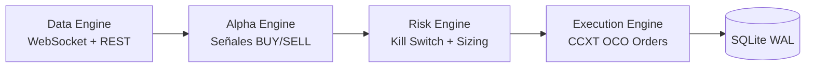
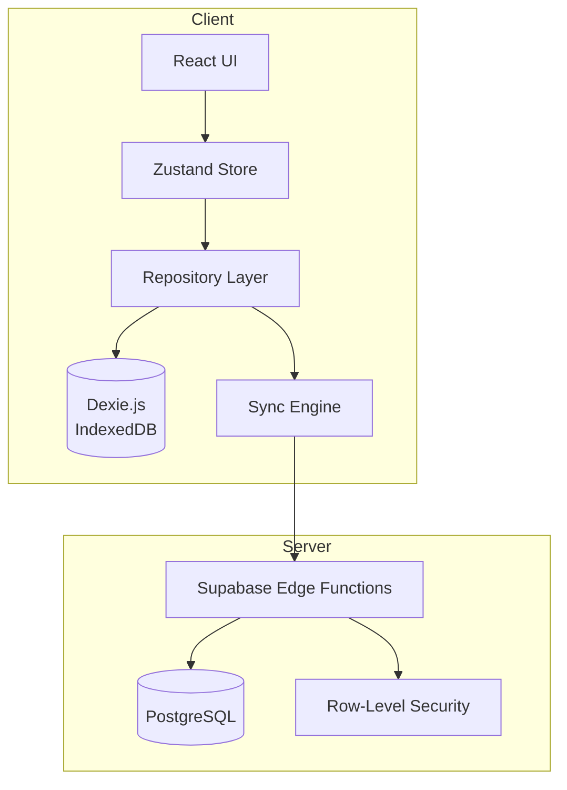

# 🏗️ Ecosistema Completo de Proyectos — Auditoría de Herramientas y Configuración

> **Autor**: Antigravity AI  
> **Fecha**: 28 de marzo de 2026  
> **Alcance**: Todos los proyectos activos del portafolio

---

## 📊 Resumen Ejecutivo

| # | Proyecto | Dominio | Estado | Stack Principal |
|---|----------|---------|--------|-----------------|
| 1 | **Alze OS** | Sistema Operativo (Anykernel x86_64) | Feature Freeze / Hardening | C, NASM, QEMU |
| 2 | **CT4 Trading Bot** | Trading automatizado de criptomonedas | Producción (Paper Trading) | Python 3.12, CCXT, FastAPI |
| 3 | **HarvestPro NZ** | App de gestión agrícola (NZ) | Producción | React/TypeScript, Supabase, Zustand |
| 4 | **ALZE Engine** | Motor de física/simulación científica | Desarrollo activo | C++, XPBD, OpenGL |
| 5 | **PhysicsEngine2D** | Motor de física 2D (precursor ALZE) | Completo → Transición 3D | C++, SFML, ECS |
| 6 | **Ultra System** | Infraestructura de automatización | Desplegado en Hetzner | Node.js, Docker |
| 7 | **AgenticOS** | Ecosistema AI agentic | Configuración | Ollama, MCP, Claude Code |

---

## 🖥️ Entorno de Desarrollo Global

### Máquina de Trabajo
| Componente | Detalle |
|------------|---------|
| **OS** | Windows 11 |
| **Shell principal** | PowerShell + MSYS2 (MinGW64) |
| **Editor / IDE** | VS Code + Gemini Code Assist (Antigravity) |
| **Control de versiones** | Git |
| **Virtualización** | QEMU, Docker Desktop, WSL2 |

### Herramientas de IA Integradas
| Herramienta | Uso |
|-------------|-----|
| **Gemini Code Assist (Antigravity)** | Asistente de desarrollo principal, pair programming |
| **Ollama (Qwen 2.5)** | Modelo local para operaciones autónomas |
| **Claude Code** | Ejecución agentic de tareas |
| **MCP Servers** | Extensiones para GitHub, Supabase, Filesystem, Stitch |

### Infraestructura Remota
| Servidor | Proveedor | IP | Uso |
|----------|-----------|-----|-----|
| **VPS Trading** | Hetzner Cloud (Helsinki) | `95.217.158.7` | CT4 Trading Bots 24/7 |
| **VPS Ultra** | Hetzner Cloud | — | Ultra System deployment |

---

## 1. 🔧 Alze OS (Anykernel v2.1)

> **Objetivo**: Kernel x86_64 propio con inspiración en Linux, macOS y Windows NT.

### Herramientas de Build

| Herramienta | Versión/Config | Propósito |
|-------------|---------------|-----------|
| **Clang** | `--target=x86_64-unknown-none` | Compilador C (freestanding, kernel mode) |
| **ld.lld** | GNU flavor, `elf_x86_64` | Linker con `linker.ld` custom |
| **NASM** | `-f elf64 -g -F dwarf` | Ensamblador x86_64 (trampoline, context switch, syscall entry) |
| **MSYS2/MinGW64** | Windows PATH integration | Toolchain UNIX-like en Windows |
| **xorriso** | — | Generación de imágenes ISO bootables |
| **QEMU** | `qemu-system-x86_64` | Emulador para testing (`-smp 4/8`, `-m 128M`) |

### Configuración de Compilador (CFLAGS)

```
-ffreestanding -fstack-protector-strong -fno-pic -mno-red-zone
-mno-sse -mno-sse2 -mno-mmx -mcmodel=kernel
-Wall -Wextra -Werror -std=gnu11 -O2 -g
```

### Dependencias Core

| Componente | Tipo | Descripción |
|------------|------|-------------|
| **Limine** | Bootloader | Protocolo de arranque, HHDM, framebuffer |
| **ACPI MADT** | Hardware | Detección de CPUs y APIC para SMP |
| **Local APIC + I/O APIC** | Hardware | Interrupciones y timer per-CPU |
| **PCI Bus** | Hardware | Enumeración de dispositivos (AHCI, E1000, xHCI) |

### Subsistemas Implementados (80+ archivos .c/.h/.asm)

| Subsistema | Archivos Clave | Inspiración |
|------------|---------------|-------------|
| **GDT / TSS per-CPU** | `gdt.c`, `gdt.h` | x86_64 Long Mode spec |
| **IDT + Excepciones** | `idt.c`, `interrupts.asm` | #DE, #UD, #DF, #GP, #PF |
| **PMM (Buddy Allocator)** | `pmm.c` | Linux buddy system |
| **VMM (Page Tables)** | `vmm.c`, `vma.c` | W^X enforcement (OpenBSD) |
| **Slab Allocator + Magazine Cache** | `kmalloc.c`, `magazine.c` | Solaris umem (Bonwick 2001) |
| **O(1) Scheduler** | `sched.c` | Linux O(1), macOS QoS |
| **SMP (INIT-SIPI-SIPI)** | `smp.c`, `ap_trampoline.asm` | Linux `smpboot.c` |
| **Per-CPU Data (GS Segment)** | `percpu.c`, `percpu.h` | Linux per_cpu, Windows KPCR |
| **Ticket Spinlocks** | `spinlock.h` | FIFO fair, IRQ-safe |
| **SYSCALL/SYSRET** | `syscall.c`, `syscall_entry.asm` | AMD64 fast path |
| **VFS + devfs + procfs + ramfs** | `vfs.c`, `devfs.c`, etc. | UNIX VFS layer |
| **ELF Loader + Userspace** | `elf.c`, `uspace.c`, `usermode.asm` | Linux ELF loading |
| **Signals (POSIX)** | `signal.c` | SIGINT, SIGSTOP, SIGQUIT |
| **io_uring** | `iouring.c` | Linux io_uring (async I/O) |
| **Work-Stealing Scheduler** | `sched.c` (AP idle loop) | Cilk, Go goroutine runtime |
| **E1000 NIC Driver** | `e1000.c` | Intel Gigabit Ethernet |
| **AHCI (SATA)** | `ahci.c` | AHCI 1.0 spec |
| **Thermal Throttling** | `thermal.c` | Gradual throttle 70/80/90°C |
| **Memory Compression** | `memcompress.c` | macOS memory compressor |
| **Page Dedup (KSM++)** | `dedup.c` | Linux KSM |
| **Zero-Copy I/O** | `zerocopy.c` | Linux `splice()` / `sendfile()` |
| **Capability Security** | `capability.c` | seL4 / Capsicum |
| **Live Patching** | `livepatch.c` | Linux kpatch |
| **Shared Memory** | `shm.c` | POSIX shm |
| **Swap** | `swap.c` | Linux swap subsystem |
| **DPC (Deferred Procedure Calls)** | `dpc.c` | Windows DPC |
| **Prefetch (Markov)** | `prefetch.c` | Predictive page prefetcher |
| **IRQ Coalescing** | `irq_coalesce.c` | Adaptive interrupt batching |

### QEMU Debugging Config
```bash
qemu-system-x86_64 -smp 4 -m 128M -cdrom build/os.iso \
  -serial stdio -no-reboot -no-shutdown \
  -d int,cpu_reset -D qemu.log
```

### Estado Actual
- ✅ **4/4 CPUs online** (SMP estable, bug `ltr` resuelto)
- ✅ **64/64 self-tests passing**
- ✅ W^X enforcement activo
- 🔄 Magazine Cache integrado (pendiente build final)
- 🔄 Cache-line alignment aplicado a estructuras per-CPU

---

## 2. 📈 CT4 Trading Bot (Crypto-Trading-Bot4)

> **Objetivo**: Bot de trading automatizado para criptomonedas con gestión de riesgo.

### Stack Tecnológico

| Capa | Tecnología | Detalle |
|------|-----------|---------|
| **Lenguaje** | Python 3.12+ | Asyncio nativo |
| **Exchange API** | CCXT | Conectividad Binance (Spot) |
| **Indicadores** | pandas-ta | RSI, ADX, EMA, BB (Numba-accelerated) |
| **Base de datos** | SQLite (WAL mode) | `aiosqlite`, persistencia transaccional |
| **Dashboard** | FastAPI + Tailwind CSS | Monitoreo en tiempo real |
| **Notificaciones** | Telegram Bot API | Alertas de trades y kill switch |
| **Entorno Python** | venv (`/opt/ct4/venv/`) | Aislamiento de dependencias |

### Arquitectura: 4 Motores Desacoplados



### Bots Activos en Producción

| Bot | Estrategia | Estado | Observación |
|-----|-----------|--------|-------------|
| **V15 Scalper** | RSI7+ADX, 15m, 12 coins | ⚠️ Kill Switch | 61.3% WR, R:R necesita ajuste |
| **V11 Monitor** | Oversold Scoring (0-100) | ✅ Operativo | Enfocado en coins <$3 |
| **Grid Bot** | Grid Trading | ✅ Running | Más antiguo (desde Mar 14) |
| **API Dashboard** | — | ✅ Running | FastAPI en puerto HTTP |
| **Telegram Monitor** | — | ✅ Running | Alertas en tiempo real |

### Infraestructura de Despliegue

| Aspecto | Configuración |
|---------|---------------|
| **Servidor** | Hetzner VPS, Ubuntu 24.04, Helsinki |
| **Deploy** | SCP manual (sin Git en server) |
| **Service Manager** | systemd (`ct4-bot.service`) |
| **Auto-restart** | Habilitado, delay 10s |
| **Directorio** | `/opt/ct4/` (venv, db, logs, state) |
| **Modo** | `PAPER_TRADING=True` (keys reales Binance) |

### Roadmap
- Migración a **Jupiter DEX (Solana)** para fees más bajos
- Fix del ratio R:R (wins demasiado pequeños vs losses)
- Implementar cooldown anti-churn por coin

---

## 3. 🌾 HarvestPro NZ

> **Objetivo**: App de gestión de cosecha, asistencia y nómina para huertos en Nueva Zelanda.

### Stack Tecnológico

| Capa | Tecnología | Detalle |
|------|-----------|---------|
| **Frontend** | React + TypeScript | SPA con Vite |
| **State Management** | Zustand | Singleton store con slices |
| **Styling** | Tailwind CSS | Responsive, field-optimized UI |
| **Backend** | Supabase | PostgreSQL + Auth + Realtime + Edge Functions |
| **Offline Storage** | Dexie.js (IndexedDB) | Persistencia offline-first |
| **Validation** | Zod | Schemas compartidos client/server |
| **Testing** | Vitest | 2,400+ tests (488 unit, 89 integration) |
| **Hosting** | Vercel | Frontend deployment |
| **Auth** | Supabase Auth | JWT + RBAC (owner/manager/supervisor/picker) |

### Arquitectura



### Patrones Clave

| Patrón | Implementación |
|--------|---------------|
| **Offline-First Sync** | Dexie → Queue → Supabase (timestamp reconciliation) |
| **Web Locks API** | `harvest_sync_lock` para concurrencia cross-tab |
| **Observable State Testing** | Tests contra estado resultante del store, no llamadas a mocks |
| **Domain Orchestrators** | `HarvestCycleOrchestrator`, `PayrollOrchestrator` |
| **API Gateway** | Edge Functions con RBAC centralizado |
| **Rate Limiting** | Sliding window in-memory (60 req/min/user) |
| **Batch Processing** | 50-100 registros por transacción de sync |

### Seguridad

| Mecanismo | Detalle |
|-----------|---------|
| **CORS** | Allowlist dinámica (prod, preview, dev) |
| **Zod Validation** | Input sanitization en todos los endpoints |
| **Audit Logs** | Server-verified timestamps + client IP |
| **Optimistic Locking** | `updated_at` comparison para conflictos |
| **Error Sanitization** | Mensajes genéricos al cliente, logs detallados en server |

### Métricas de Calidad
- **Cobertura**: 49.92% líneas, 577 tests nuevos en sprint
- **Tests totales**: 2,400+ pasando
- **Build time**: -15.4% tras modularización

---

## 4. ⚙️ ALZE Engine (Motor Científico)

> **Objetivo**: Simulación de mecánica de sólidos avanzada (plasticidad, fractura, fatiga).

### Stack Tecnológico

| Componente | Tecnología |
|-----------|-----------|
| **Lenguaje** | C++ (Modern C++17/20) |
| **Física** | XPBD (Extended Position-Based Dynamics) |
| **Renderizado** | OpenGL |
| **Build System** | CMake |
| **Testing** | Unit tests de alta precisión |

### Subsistemas en Desarrollo
- Plasticidad (deformación permanente)
- Fractura de materiales
- Fatiga de materiales
- Pipeline de simulación de soft bodies

---

## 5. 🎮 PhysicsEngine2D

> **Objetivo**: Motor de física 2D con ECS, precursor del ALZE Engine 3D.

### Stack Tecnológico

| Componente | Tecnología |
|-----------|-----------|
| **Lenguaje** | C++ |
| **Gráficos** | SFML |
| **Arquitectura** | ECS (Entity-Component-System) |
| **Colisiones** | SpatialHash broad-phase + Raycasting |
| **Audio** | Procedural sound caching (zero-allocation) |
| **Matemáticas** | SIMD-ready Vector2D, Matrix3x3 |

### Métricas Finales (Phase 2.5 — Completo)
- **262 tests**, 0 fallos
- **5,000 entidades** @ 168+ FPS
- **47 archivos**, 5,983 LOC
- **PlayState.h**: 758 → 289 líneas (-62%)
- Next: Transición a OpenGL/3D

---

## 6. 🔌 Ultra System

> **Objetivo**: Infraestructura unificada de automatización, reemplazo de 8 servicios Docker.

### Stack Tecnológico

| Componente | Tecnología |
|-----------|-----------|
| **Runtime** | Node.js |
| **Contenedores** | Docker (migración desde 8 servicios) |
| **Despliegue** | Hetzner VPS |
| **Arquitectura** | Motor unificado custom |

---

## 7. 🤖 AgenticOS (Ecosistema AI)

> **Objetivo**: Operaciones autónomas controladas desde móvil para 7 proyectos.

### Stack Tecnológico

| Componente | Tecnología | Propósito |
|-----------|-----------|-----------|
| **AI Local** | Ollama (Qwen 2.5) | Modelo local para autonomía |
| **AI Remoto** | Claude Code | Ejecución agentic |
| **MCP GitHub** | MCP Server | Control de repositorios |
| **MCP Supabase** | MCP Server | Operaciones de base de datos |
| **MCP Filesystem** | MCP Server | Control de archivos local |
| **Branching** | Git Worktrees | Gestión paralela de 7 proyectos |
| **Automation** | Git Hooks | Pre-commit, post-merge |
| **Workstation** | Windows 11 + Mobile | Control remoto desde teléfono |

---

## 📋 Mapa Global de Tecnologías

### Lenguajes de Programación
| Lenguaje | Proyectos |
|----------|-----------|
| **C** | Alze OS |
| **C++** | ALZE Engine, PhysicsEngine2D |
| **Python 3.12** | CT4 Trading Bot |
| **TypeScript/React** | HarvestPro NZ |
| **x86_64 Assembly (NASM)** | Alze OS (trampoline, context switch, syscall) |
| **Node.js** | Ultra System |

### Bases de Datos
| DB | Proyecto | Modo |
|----|----------|------|
| **PostgreSQL** | HarvestPro NZ (via Supabase) | Cloud + Local Docker |
| **SQLite** | CT4 Trading Bot | WAL mode, aiosqlite |
| **IndexedDB** | HarvestPro NZ (via Dexie.js) | Offline-first cache |

### Infraestructura
| Servicio | Uso |
|----------|-----|
| **Hetzner Cloud** | CT4 (24/7 trading), Ultra System |
| **Vercel** | HarvestPro NZ frontend hosting |
| **Supabase Cloud** | HarvestPro NZ backend (Auth, DB, Realtime, Edge Functions) |
| **Docker** | Ultra System, Supabase local dev |
| **QEMU** | Alze OS emulación y testing |
| **systemd** | CT4 service management en VPS |

### Testing Frameworks
| Framework | Proyecto | Tests |
|-----------|----------|-------|
| **Vitest** | HarvestPro NZ | 2,400+ |
| **Self-test suite (custom)** | Alze OS | 64 kernel tests |
| **Custom test harness** | PhysicsEngine2D | 262 tests |
| **Lab Backtesting** | CT4 Trading Bot | 6 meses datos reales |

### APIs y Servicios Externos
| API | Proyecto | Propósito |
|-----|----------|-----------|
| **Binance WebSocket/REST** | CT4 | Market data + Order execution |
| **CCXT** | CT4 | Abstracción multi-exchange |
| **Telegram Bot API** | CT4 | Alertas y notificaciones |
| **Supabase API** | HarvestPro NZ | Auth, DB, Realtime, Storage |
| **Jupiter DEX (Solana)** | CT4 (roadmap) | Trading descentralizado |

---

## 🔐 Seguridad — Resumen Cross-Project

| Proyecto | Mecanismos de Seguridad |
|----------|------------------------|
| **Alze OS** | W^X enforcement (OpenBSD), stack canaries, KASLR, NX bit, guard pages, capability-based security, quarantine malloc |
| **CT4** | Kill Switch automático, drawdown limits, API key isolation, paper trading mode |
| **HarvestPro NZ** | RBAC (JWT), RLS (Row-Level Security), Zod validation, CORS allowlist, rate limiting, audit logs, error sanitization |

---

## 📈 Métricas Globales del Portafolio

| Métrica | Valor |
|---------|-------|
| **Proyectos activos** | 7 |
| **Lenguajes utilizados** | 6 (C, C++, Python, TypeScript, ASM, JS) |
| **Tests totales** | ~2,726+ (2,400 HarvestPro + 262 Physics2D + 64 Alze OS) |
| **Servidores en producción** | 2 (Hetzner VPS) |
| **Archivos del kernel Alze OS** | 80+ (.c/.h/.asm) |
| **Bots de trading en ejecución** | 5 (V15, V11, Grid, Dashboard, Telegram) |
| **CPUs del kernel arrancando** | 4/4 (SMP estable) |
