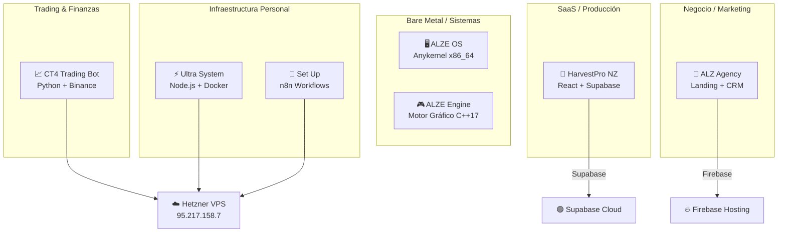

# 🌐 Ecosistema Ibrahim Boutebila — Inventario Técnico Completo
> Generado: 2026-03-28 | 7 proyectos activos | 1 servidor VPS | 12+ lenguajes/frameworks

---

## 📊 Resumen Ejecutivo

| Métrica | Valor |
|---------|-------|
| **Proyectos activos** | 7 |
| **Líneas de código totales** | ~135,000+ |
| **Tests totales** | ~4,200+ |
| **Lenguajes principales** | C++17, C, x86 ASM, Python, TypeScript, JavaScript, SQL, HTML/CSS |
| **Infraestructura** | 1× Hetzner VPS (95.217.158.7) + Firebase Hosting + Supabase Cloud |
| **Dominio de conocimiento** | Sistemas Operativos, Motores Gráficos, Trading Algorítmico, SaaS AgriTech, Automatización Personal |

---

## 🗂️ Mapa de Proyectos



---

## 1. 🎮 ALZE Engine — Motor Gráfico Multifísico

| Campo | Valor |
|-------|-------|
| **Ruta** | `C:\Users\ibrab\Desktop\alze` |
| **Lenguaje** | C++17 (sin RTTI, sin excepciones) |
| **Build** | CMake 3.20+ / Ninja / MinGW / g++ |
| **Líneas** | ~11,000+ |
| **Tests** | 352 pasando ✅ |
| **Score Auditoría** | 4.6/5.0 |

### Stack Técnico

| Capa | Herramienta | Versión/Detalles |
|------|-------------|------------------|
| **Build System** | CMake + Ninja | MinGW / MSYS2, también compilación manual g++ |
| **Gráficos** | OpenGL (GLAD loader) | Forward + Deferred rendering, PBR, SSAO, Bloom |
| **Ventana** | SDL2 | v2.30.12 (FetchContent o MSYS2 local) |
| **Modelos 3D** | cgltf | Single-header glTF parser |
| **ECS** | Custom | Compile-time IDs, QueryCache, parallel forEach |
| **Física** | Custom XPBD | 20+ disciplinas científicas |
| **Renderer** | Custom PBR | Sombras, frustum culling, material batching |

### Módulos de Física (36 headers)

| Módulo | Descripción | Fórmulas Clave |
|--------|-------------|----------------|
| `RigidBody3D` | Dinámica de cuerpo rígido | Newton-Euler, Verlet |
| `Collider3D` | Sphere, AABB, OBB, Capsule, ConvexHull | GJK, SAT |
| `SoftBody3D` | XPBD con plasticidad y fatiga | Von Mises, Palmgren-Miner |
| `FluidSystem` | SPH Smoothed Particle Hydrodynamics | Navier-Stokes (Lagrangiano) |
| `Thermodynamics` | Conducción, radiación, cambio de fase | Fourier, Stefan-Boltzmann, Latent Heat |
| `Chemistry` | Arrhenius, pH, estequiometría | $k = Ae^{-E_a/RT}$, Nernst |
| `Electromagnetism` | Coulomb, Lorentz, Faraday | $\vec{F} = q(\vec{E} + \vec{v} \times \vec{B})$ |
| `CompressibleFlow` | Ondas de choque, Mach | Rankine-Hugoniot |
| `NuclearPhysics` | Desintegración, fusión | $E = mc^2$, half-life |
| `Relativity` | Lorentz, dilatación temporal | $\gamma = 1/\sqrt{1-v^2/c^2}$ |
| `QuantumSystem` | De Broglie, tunneling, H-atom | Schrödinger |
| `MHDSystem` | Magnetohidrodinámica | Alfvén, plasma β |
| `Hyperelasticity` | Neo-Hookean, Mooney-Rivlin | Strain energy density |
| `MolecularDynamics` | Lennard-Jones, Morse | Potenciales interatómicos |
| `OpticsSystem` | Snell, Fresnel, Wien | Óptica geométrica + ondas |
| `WaveSystem` | Doppler, interferencia | Acústica |
| `GravityNBody` | Barnes-Hut octree | $F = Gm_1m_2/r^2$ |
| `FractureSystem` | Von Mises, Griffith | Mecánica de fractura |

### Variables de Entorno
- **Ninguna** — proyecto nativo sin dependencias externas

---

## 2. 🖥️ ALZE OS — Sistema Operativo Anykernel

| Campo | Valor |
|-------|-------|
| **Ruta** | `C:\Users\ibrab\Desktop\alze os` |
| **Lenguaje** | C (kernel) + x86-64 Assembly (NASM) |
| **Build** | Make + Clang/LLD + NASM |
| **Líneas** | ~19,000+ |
| **Tests** | 46 kernel + 5 runtime |
| **Versión** | v0.7.0 |
| **Kernel Size** | 76 KB |
| **Boot Time** | 90 ms |

### Toolchain

| Herramienta | Uso |
|-------------|-----|
| **Clang** | Compilador C (target x86_64-unknown-none, -ffreestanding) |
| **ld.lld (LLVM)** | Linker |
| **NASM** | Ensamblador x86-64 |
| **xorriso** | Creación de ISO bootable |
| **QEMU** | Emulación y testing |
| **GDB** | Debugging remoto |
| **Limine** | Bootloader (submódulo) |

### Flags de Compilación
```
-ffreestanding -fstack-protector-strong -mcmodel=kernel
-mno-sse -mno-sse2 -mno-mmx -Wall -Wextra -Werror
```

### Subsistemas del Kernel

| Subsistema | Archivo Principal | Líneas |
|------------|-------------------|--------|
| Scheduler (preemptivo, 3 niveles) | `kernel/sched.c` | 1,182 |
| Test Suite | `kernel/tests.c` | 1,119 |
| System Calls | `kernel/syscall.c` | 884 |
| Virtual Memory Manager | `kernel/vmm.c` | 829 |
| Filesystem ext2 | `kernel/ext2.c` | 789 |

### Arquitectura Boot
```
Limine → GDT/TSS → IDT → PIC/PIT → PMM (buddy allocator)
→ VMM (4-level paging) → kmalloc (slab) → Scheduler → Sync → IPC → VFS → ext2 → Network → SMP
```

---

## 3. 📈 Crypto-Trading-Bot4 (CT4)

| Campo | Valor |
|-------|-------|
| **Ruta** | `C:\Users\ibrab\Desktop\Crypto-Trading-Bot4` |
| **Lenguaje** | Python 3.13 |
| **Despliegue** | Hetzner VPS (`/opt/ct4/`) |
| **Exchange** | Binance (Spot API, Paper Trading) |
| **Versión activa** | V15 Scalper |

### Stack

| Capa | Paquete | Versión |
|------|---------|---------|
| **Exchange API** | ccxt | ≥4.2.0 |
| **API Server** | FastAPI + Uvicorn | ≥0.110.0 |
| **WebSockets** | websockets | ≥12.0 |
| **Análisis técnico** | pandas + pandas-ta | ≥2.2.0 |
| **Base de datos** | aiosqlite | ≥0.20.0 |
| **Notificaciones** | python-telegram-bot | ≥21.0 |
| **HTTP Async** | aiohttp | ≥3.9.0 |
| **Testing** | pytest + pytest-asyncio | ≥8.0.0 |
| **Config** | python-dotenv | ≥1.0.1 |

### Arquitectura 4 Motores

| Motor | Archivo | Tamaño | Función |
|-------|---------|--------|---------|
| **Execution** | `execution_engine.py` | ~27 KB | Ejecución de órdenes |
| **Backtest** | `backtest_engine.py` | ~19 KB | Backtesting con datos reales |
| **Monitor** | `monitor_engine.py` | ~14 KB | Monitor 0-100 scoring |
| **Data** | `data_engine.py` | ~13 KB | WebSocket + candles |
| **News** | `news_engine.py` | ~12 KB | CryptoPanic feed |

### Bots Activos en Servidor

| Bot | Estado | Capital | Win Rate |
|-----|--------|---------|----------|
| V15 Scalper | ✅ Activo | $1000 paper | 61.3% (235 trades) |
| Grid Bot | ✅ Activo | — | — |
| V11 Monitor | ⏸️ Reactivado | — | Entry scoring |

### Variables de Entorno
```
EXCHANGE_ID, API_KEY, API_SECRET, SYMBOL, SYMBOLS, TIMEFRAME,
ACTIVE_STRATEGY, CRYPTOPANIC_TOKEN, TELEGRAM_BOT_TOKEN,
TELEGRAM_CHAT_ID, TRADING_MODE, CAPITAL, DAILY_LOSS_LIMIT,
MAX_DRAWDOWN_LIMIT, SLIPPAGE_MAX
```

---

## 4. 🍎 HarvestPro NZ — Plataforma AgriTech SaaS

| Campo | Valor |
|-------|-------|
| **Ruta** | `C:\Users\ibrab\Desktop\harvestpro-nz` |
| **Versión** | v9.9.0 |
| **Líneas** | ~92,000 |
| **Tests** | 3,800+ pasando |
| **Cobertura** | ~50% |

### Stack Completo

| Capa | Tecnología | Versión |
|------|------------|---------|
| **UI Framework** | React | 19 |
| **Lenguaje** | TypeScript | 5.3 |
| **Bundler** | Vite | 7.3.1 |
| **Estilos** | Tailwind CSS | 3.4.0 |
| **Estado** | Zustand | 5.0.11 |
| **Server State** | TanStack React Query | 5.90.21 |
| **Routing** | React Router | 7.13.0 |
| **Backend/Auth** | Supabase (PostgreSQL) | supabase-js 2.39.0 |
| **Offline DB** | Dexie (IndexedDB) | 3.2.4 |
| **Mobile** | Capacitor (Android) | 8.2.0 |
| **Validación** | Zod | 4.3.6 |
| **QR Scanner** | html5-qrcode | 2.3.8 |
| **CSV** | papaparse | 5.5.3 |
| **Virtual Lists** | react-virtuoso | 4.18.1 |
| **Analytics** | PostHog | 1.345.3 |
| **Error Tracking** | Sentry | @sentry/react 10.39.0 |
| **Crypto** | crypto-js | 4.2.0 |
| **Unit Tests** | Vitest | — |
| **E2E Tests** | Playwright | — |
| **Storybook** | Storybook | — |
| **CI/CD** | GitHub Actions | `.github/workflows/` |
| **Lint** | Husky + lint-staged | `.husky/` |

### Variables de Entorno
```
VITE_SUPABASE_URL, VITE_SUPABASE_ANON_KEY,
VITE_VAPID_PUBLIC_KEY, GEMINI_API_KEY
```

---

## 5. 💼 ALZ Agency — Landing Page + CRM

| Campo | Valor |
|-------|-------|
| **Ruta** | `C:\Users\ibrab\Desktop\money` |
| **Stack** | HTML5 / CSS3 / JS vanilla |
| **Hosting** | Firebase Hosting |
| **CRM** | Google Sheets via Apps Script |

### Herramientas Externas

| Herramienta | Uso |
|-------------|-----|
| **Firebase Hosting** | Deploy estático (`.firebaserc`, `firebase.json`) |
| **Google Analytics GA4** | Tracking de visitantes |
| **Three.js** (CDN) | Efectos de partículas 3D en hero section |
| **n8n** (Hetzner) | Webhook HTTPS para captura de leads |
| **Google Apps Script** | CRM → Google Sheets (`ALZ_Google_Sheets_Script.js`) |

### Archivos Clave

| Archivo | Tamaño | Contenido |
|---------|--------|-----------|
| `styles.css` | ~53 KB | Diseño completo dark premium |
| `index.html` | ~42 KB | Landing page principal |
| `effects.js` | ~13 KB | Animaciones Three.js |
| `contact.html` | ~10 KB | Formulario de contacto |

### Variables de Entorno
- Sin `.env` — Config via `.firebaserc` + IDs en HTML

---

## 6. ⚡ Ultra System — Sistema de Inteligencia Personal

| Campo | Valor |
|-------|-------|
| **Ruta** | `C:\Users\ibrab\Desktop\vida, control` |
| **Stack** | Node.js + Express 5.1 + PostgreSQL 16 |
| **Despliegue** | Docker Compose → Hetzner VPS |
| **Contenedores** | 2 (db + engine) — antes eran 8 |

### Stack

| Capa | Paquete | Función |
|------|---------|---------|
| **Backend** | Express | 5.1.0 – API REST + Scheduler |
| **Base de Datos** | PostgreSQL (pg) | 8.13.0 – Única dependencia externa |
| **Scheduler** | node-cron | 3.0.3 – Tareas programadas |
| **Bot** | node-telegram-bot-api | 0.66.0 – Reemplaza n8n |
| **OCR** | Tesseract.js | 5.1.1 – ESP + ENG bilingüe |
| **RSS** | rss-parser | 3.13.0 – Reemplaza Miniflux |
| **Scraper** | Cheerio | 1.0.0 – Reemplaza Changedetection |
| **Upload** | Multer | 1.4.5-lts.1 – Archivos |
| **PDF** | pdf-parse | 1.1.1 – Procesamiento PDF |
| **Config** | dotenv | 16.4.0 |

### Los 7 Pilares

| Pilar | Estado |
|-------|--------|
| 1. Noticias (RSS reader) | ✅ Activo |
| 2. Empleo Físico (scraper) | ✅ Activo |
| 3. Finanzas (tracking) | ✅ Activo |
| 4. Burocracia (OCR + alertas) | ✅ Activo |
| 5. Salud | 🔄 En desarrollo |
| 6. Educación | 🔄 En desarrollo |
| 7. Social | 🔄 En desarrollo |

### Variables de Entorno
```
POSTGRES_USER, POSTGRES_PASSWORD, POSTGRES_DB,
TELEGRAM_BOT_TOKEN, TELEGRAM_CHAT_ID, TZ
```

---

## 7. 🔧 Set Up — Workflows n8n

| Campo | Valor |
|-------|-------|
| **Ruta** | `C:\Users\ibrab\Desktop\set up` |
| **Stack** | Node.js (ssh2) + JSON workflows |
| **Destino** | Servidor n8n en Hetzner |

### Workflows Disponibles

| Workflow | Función |
|----------|---------|
| `daily_briefing.json` | Resumen diario automático |
| `crypto_alerts.json` | Alertas de precio crypto |
| `github_auto-backup.json` | Backup repos a servidor |
| `uptime_monitor.json` | Monitoreo de servicios |
| `ai_agent_dump.json` | Agente IA en n8n |
| `lead-capture.json` | Captura leads → Google Sheets |

---

## ☁️ Infraestructura — Hetzner VPS

| Campo | Valor |
|-------|-------|
| **IP** | 95.217.158.7 |
| **Acceso** | root (password auth) |
| **OS** | Linux |

### Servicios Desplegados

| Servicio | Puerto/Ruta | Estado |
|----------|-------------|--------|
| CT4 V15 Scalper | `/opt/ct4/` | ✅ Activo |
| CT4 Grid Bot | `/opt/ct4/` | ✅ Activo |
| CT4 API Dashboard | Puerto dedicado | ✅ Activo |
| CT4 Telegram Monitor | — | ✅ Activo |
| Ultra System (Docker) | 2 containers | ✅ Activo |
| n8n | — | ✅ Activo |
| Nginx (reverse proxy) | 80/443 | ✅ SSL configurado |

---

## 🛠️ Herramientas de Desarrollo (Máquina Local — Windows)

### IDEs y Editores
| Herramienta | Uso |
|-------------|-----|
| **Cursor** | IDE principal (acceso directo en Desktop) |
| **Antigravity** | Asistente IA integrado |

### Navegadores
| Navegador | Uso |
|-----------|-----|
| **Brave** | Navegador principal |
| **Zen** | Navegador secundario |
| **Tor Browser** | Navegación privada |

### Herramientas Dev
| Herramienta | Uso |
|-------------|-----|
| **Docker Desktop** | Contenedores locales |
| **Git** | Control de versiones |
| **CMake + Ninja** | Build C++ |
| **MSYS2 / MinGW** | Toolchain GCC/G++ para Windows |
| **Clang + LLD + NASM** | Toolchain kernel ALZE OS |
| **QEMU** | Emulación x86-64 |
| **GDB** | Debugging kernel |
| **Node.js + npm** | JavaScript/TypeScript runtime |
| **Python 3.13 + venv** | Trading bot y scripts |
| **Firebase CLI** | Deploy landing page |

### Software Adicional
| App | Uso |
|-----|-----|
| **CapCut** | Edición de video |

---

## 📈 Matriz de Lenguajes por Proyecto

| Proyecto | C++ | C | ASM | Python | TypeScript | JavaScript | HTML/CSS | SQL |
|----------|-----|---|-----|--------|------------|------------|----------|-----|
| ALZE Engine | ✅ | | | | | | | |
| ALZE OS | | ✅ | ✅ | | | | | |
| CT4 Trading | | | | ✅ | | | ✅ | ✅ |
| HarvestPro | | | | | ✅ | | ✅ | ✅ |
| ALZ Agency | | | | | | ✅ | ✅ | |
| Ultra System | | | | | | ✅ | ✅ | ✅ |
| Set Up | | | | ✅ | | ✅ | | |

---

## 🔗 Servicios Externos Configurados

| Servicio | Proyecto(s) | Configuración |
|----------|-------------|---------------|
| **Supabase** | HarvestPro | Auth + PostgreSQL + Edge Functions |
| **Firebase** | ALZ Agency | Hosting estático |
| **Binance API** | CT4 | Spot API (paper trading) |
| **Telegram Bot API** | CT4, Ultra | Notificaciones + comandos |
| **Google Analytics GA4** | ALZ Agency | Tracking web |
| **Google Apps Script** | ALZ Agency | CRM → Google Sheets |
| **n8n** | Set Up, ALZ Agency | Webhooks HTTPS, automatización |
| **PostHog** | HarvestPro | Product analytics |
| **Sentry** | HarvestPro | Error tracking |
| **CryptoPanic** | CT4 | News feed API |
| **Hetzner** | CT4, Ultra, n8n | VPS cloud |
| **GitHub Actions** | HarvestPro | CI/CD pipeline |

---

## 📋 Estado de Git por Proyecto

| Proyecto | Git | Último Commit | Estado |
|----------|-----|---------------|--------|
| ALZE Engine | ✅ | v0.7.0 (compartido con OS) | Limpio |
| ALZE OS | ✅ | v0.7.0 | Limpio |
| CT4 | ✅ | 3 commits | 9+ archivos modificados |
| HarvestPro | ✅ | Sprint 19 | Limpio (1 untracked) |
| ALZ Agency | ✅ | 1 commit | 4 modified, 15+ untracked |
| Ultra System | ❌ | No tiene Git | — |
| Set Up | ❌ | No tiene Git | — |

> [!WARNING]
> **Ultra System** y **Set Up** no tienen repositorio Git propio. Se recomienda inicializar repositorios para proteger este código.

> [!WARNING]
> **ALZ Agency** tiene la mayoría del proyecto sin commitear (15+ archivos untracked). Riesgo de pérdida de datos.

---

## 🎯 Resumen de Capacidades Técnicas

| Dominio | Nivel | Evidencia |
|---------|-------|-----------|
| **Sistemas Operativos** | 🟢 Avanzado | Kernel bare-metal x86_64 con scheduler, VMM, ext2, SMP |
| **Motores Gráficos** | 🟢 Avanzado | PBR renderer + 20 disciplinas de física + 352 tests |
| **Trading Algorítmico** | 🟡 Intermedio-Alto | 4 motores, backtest con datos reales, 235+ trades live |
| **SaaS Full-Stack** | 🟢 Avanzado | 92K LOC, 3800 tests, offline-first, mobile-ready |
| **DevOps / Infra** | 🟡 Intermedio | Docker, VPS, nginx, SSL, scripts deploy |
| **Marketing Digital** | 🟡 Intermedio | Landing premium, GA4, CRM, n8n automation |
| **Automatización Personal** | 🟢 Avanzado | OCR, RSS, scraping, Telegram bot, todo self-hosted |

---

*Fin del inventario — Ecosistema Ibrahim Boutebila 2026*
